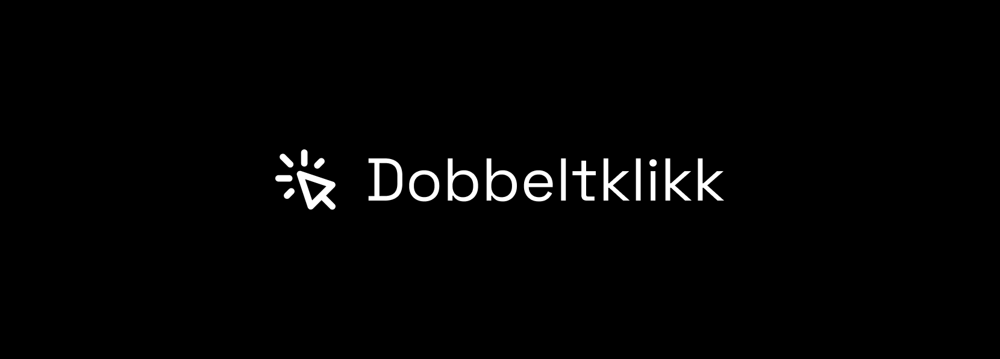

<p align="center"></p>

# Dobbeltklikk API SDK for PHP

[](https://packagist.org/packages/dobbeltklikk/dobbeltklikk-sdk)
[](https://github.com/dobbeltklikk/dobbeltklikk-sdk/actions/workflows/run-tests.yml)
[](https://packagist.org/packages/dobbeltklikk/dobbeltklikk-sdk)


## Installation

```shell
composer require dobbeltklikk/dobbeltklikk-sdk
```

## Testing

```bash
composer test
```


## License

The MIT License (MIT). Please see [License File](LICENSE.md) for more information.
